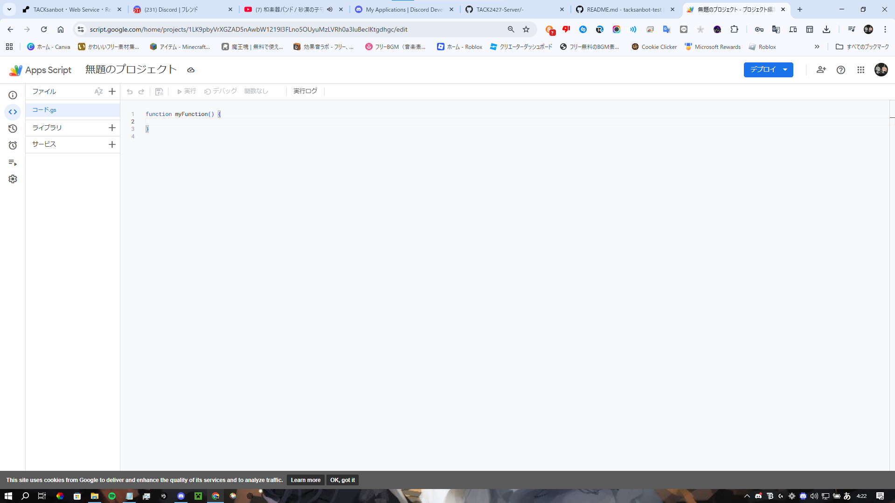
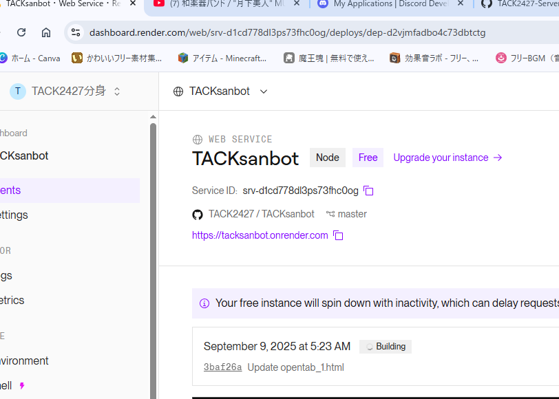
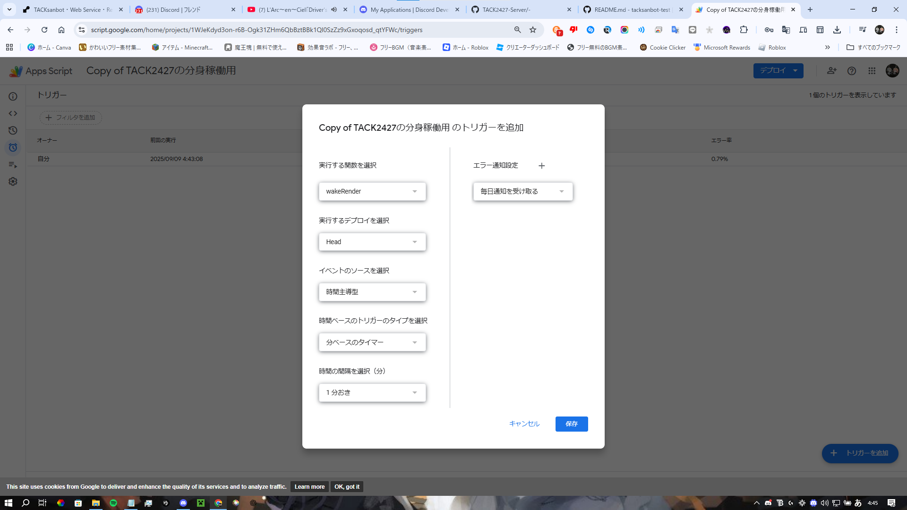

# BOT作成方法

## リポジトリコピー


[https://github.com/TACK2427/tacksanbot-test](https://github.com/TACK2427/tacksanbot-test)の上の方にUse this templateがありますそれをクリックしてください
[1](./image/1/image-09-09-2025_03_20_AM.png)

そしたらRepository name決めて公開か非公開設定してください
[1_1](/image/1/image-09-09-2025_03_40_AM.png)
それで作成したらつぎに

[ここ](https://dashboard.render.com/register)からRenderにSignupしてください

サインアップ後どのようなサービスなのか選択がでます
webサービスをえらんで下さい
（画像紛失した）


そしたらお使いのGit Providerを選びます
今回はGitHubです
[2](./image/image-09-09-2025_02_12_AM.png)

サインイン後このようにリポジトリが表示されます
[3](./image/image-09-09-2025_02_15_AM.png)

そしたら名前と決めてください
指定が無ければそのままで大丈夫です
[4](./image/image-09-09-2025_02_22_AM.png)

typeはFreeにしてください
[5](./image/image-09-09-2025_02_22_AM1.png)

つぎに[ここ](https://discord.com/developers/applications)からdiscord botを新しく作ります

[6](./image/1/image-09-09-2025_02_23_AM.png)

つぎに名前を決めてください
[7](./image/1/image-09-09-2025_02_24_AM.png)

左の欄からbotをクリックしてください
[8](./image/1/image-09-09-2025_02_24_AM1.png)

そしたらReset Tokenを押してTokenをリセットしてください
※Tokenはアカウントにログインするための鍵のため公開してはならない
[8](./image/1/image-09-09-2025_02_24_AM2.png)
そしたら下にあるやつをオンにします
画像と同じにすればいいです
[9](./image/1/image-09-09-2025_04_01_AM.png)
そしたらrenderへ戻りしたにあるEnvtronment VarlablesにTokenを入れます
左側にTOKEN右側にコピーしたTOKENをいれてください
[10](./image/1/image-09-09-2025_02_26_AM.png)
そしたら下にあるDeploy Web Serviceを押して完了です
これでエラー吐かず起動ができたらつぎに２４時間オンラインにする方法です


[https://script.google.com/home](https://script.google.com/home)にアクセスして左の新しいプロジェクトをおしてプロジェクトを作ります
この画面になればよいです


そしたら以下のコードをコピペしてください
\https://のところは画像と同じところにある●●.onrender.comに置き換えてください


```js
var URL = "https://";
function wakeRender(){
 var params = {
   'contentType' : 'application/json; charset=utf-8',
   'method' : 'post',
   'muteHttpExceptions': true
 };
 response = UrlFetchApp.fetch(URL, params);
}
```

そしてエディタの上にあるドライブにプロジェクトを保存を押してください

ひだりのメニューからトリガー（ストップウォッチのマーク）をクリックしてトリガーに移動してください

右下のトリガーを追加をおして画像のようにしてください


それで２４時間オンラインになります
